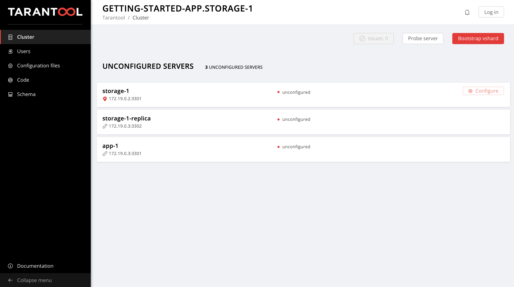
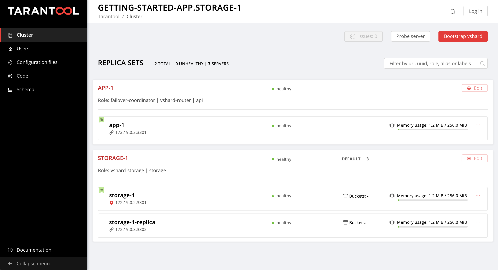
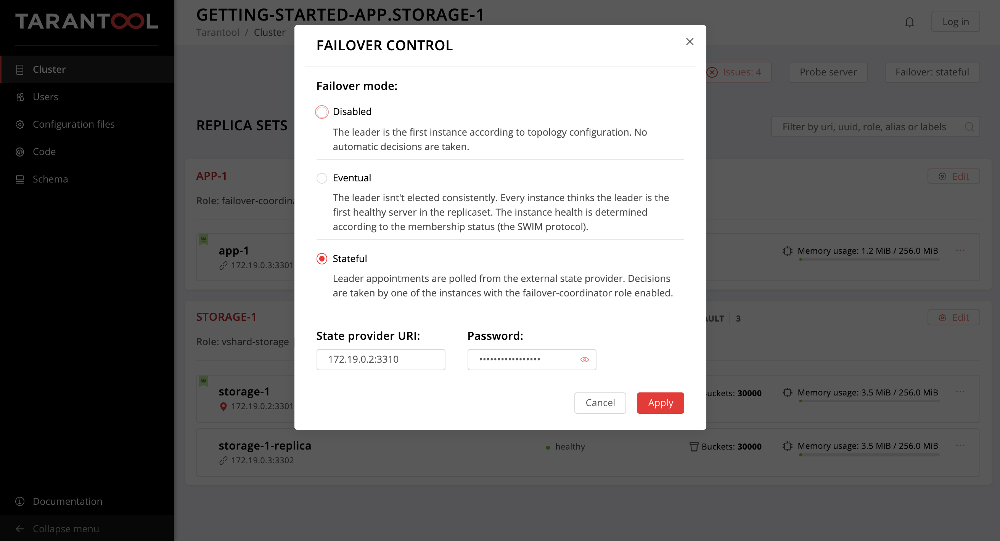
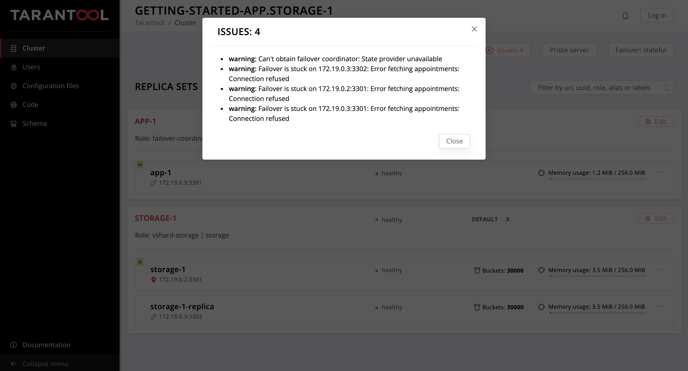

# Tarantool Cartridge application deploy example

Here we will show you how to easily deploy your Tarantool Cartridge application,
set up the topology, and configure a cluster.

## Table of contents

* [What shall we do?](#what-shall-we-do)
* [Setting up the environment](#setting-up-the-environment)
* [Deploying with Ansible](#deploying-with-ansible)
  * [About Ansible](#about-ansible)
  * [Prepare to deploy](#prepare-to-deploy)
  * [Start virtual machines](#start-virtual-machines)
  * [Start instances](#start-instances)
  * [Set up replica sets](#set-up-replica-sets)
  * [Bootstrap vshard](#bootstrap-vshard)
  * [Failover](#failover)
  * [Manage authorization](#manage-authorization)
  * [Application configuration](#application-configuration)
* [Final checks](#final-checks)
* [What does Tarantool Cartridge role do?](#what-does-tarantool-cartridge-role-do)
  * [Deploying the package](#deploying-the-package)
  * [Starting instances](#starting-instances)
  * [Setting up the topology](#setting-up-the-topology)
* [Afterword](#afterword)

## What shall we do?

We have a [getting started guide](https://github.com/tarantool/cartridge-cli/tree/master/examples/getting-started-app)
for *developing* a Tarantool Cartridge application.
Now you will learn how to *deploy* this application on servers and
*set up the topology* using Ansible.

This example directory contains `getting-started-app-1.0.0-0.rpm` file.
It's the RPM package with the example application, we will deploy in on two
virtual machines described in the [`Vagrantfile`](./Vagrantfile).

You can use your own Tarantool Cartridge application.
Use [Cartridge CLI](https://github.com/tarantool/cartridge-cli) to create
an RPM package.

**Note:** Cartridge CLI version 1.6.0 or higher is required.

In application directory:

```bash
cartridge pack rpm
```

If you use OS X to develop the application, specify `--use-docker` option
to avoid packing executables and rock modules specific for this OS:

```bash
cartridge pack rpm --use-docker
```

### Target topology

Our example application implements two roles:

* `api` (with `vshard-router` dependency),
* `storage` (with `vshard-router` dependency).

We will set up a simple topology on 2 virtual machines, `vm1` and `vm2`:

* replicaset `app-1`:
  * roles:
    * `api` (+ `vshard-router`)
    * `failover-coordinator`
  * instances:
    * `app-1` (`vm1`)

* replicaset `storage-1`
  * roles: `storage` (+ `vshard-storage`)
  * instances:
    * `storage-1` (`vm2`)
    * `storage-1-replica` (`vm1`)

In the cluster Web UI, it will look like this:

c

## Setting up the environment

To run this guide example, you need:

* `ansible` version 2.8 or higher - a deploy automation tool
  (see details [here](https://docs.ansible.com/ansible/latest/installation_guide/intro_installation.html))
* `vagrant` - a virtual machines management tool (see details [here](https://www.vagrantup.com/))

You also need to install `vagrant-hosts`, `vagrant-vbguest` and `vagrant-scp` plugins:

```bash
$ vagrant plugin install vagrant-hosts vagrant-vbguest vagrant-scp
```

## Deploying with Ansible

Now, we will start 3 instances on 2 different servers, join them in 2 replica
sets, bootstrap vshard, enable automatic failover, set up authorization and
application configuration.

If you want to understand what does this role do under the hood, you can
find the explanation in [here](#what-does-tarantool-cartridge-role-do).

### About Ansible

We will be using [Ansible](https://www.ansible.com/use-cases/application-deployment)
to deploy and configure our application.
to figure out how to work with this framework, you can read the
[docs](https://docs.ansible.com/ansible/latest/index.html) and
check out some [Russian](https://habr.com/ru/post/305400/)
/
[English](https://scotch.io/tutorials/getting-started-with-ansible))
getting-started guides.

### Prepare virtual machines

First, use [vagrant](https://www.vagrantup.com/intro/index.html) to start two
virtual machines on `172.19.0.2` and `172.19.0.3`.
This machines are described in [`Vargantfile`](./Vagrantfile).
Run in the example directory:

```bash
$ vagrant up
```

Check that machines started correctly:

```bash
$ vagrant status
```

The output shold be like:

```bash
Current machine states:

vm1                       running (virtualbox)
vm2                       running (virtualbox)
```

### Install Tarantool Cartridge role

Next, install the Tarantool Cartridge role using `ansible-galaxy` CLI:

```bash
$ ansible-galaxy install tarantool.cartridge,1.2.0
```

Let's take a look at the `playbook.yml` file.
It's an
[Ansible playbook](https://docs.ansible.com/ansible/latest/user_guide/playbooks_intro.html)
that imports the Tarantool Cartridge role.

`playbook.yml`:

```yaml
---
- name: Deploy my Tarantool Cartridge app
  hosts: all
  become: true
  become_user: root
  any_errors_fatal: true
  tasks:
  - name: Import Tarantool Cartridge role
    import_role:
      name: tarantool.cartridge
```

The most important file is [`hosts.yml`](./hosts.yml).
This is an [inventory file](https://docs.ansible.com/ansible/latest/user_guide/intro_inventory.html)
that contains cluster configuration.

All we need to do is learn how to manage instances and replica sets by modifying
this file. Later on, we will add new sections to it.
In order to avoid confusion while adding the sections, look at the final version of
this file, or [hosts.updated.yml](./hosts.updated.yml).

### Start instances

Instances configuration is already described in the `hosts.yml` file:

```yaml
---
all:
  vars:
    cartridge_app_name: getting-started-app  # application name
    cartridge_package_path: ./getting-started-app-1.0.0-0.rpm  # path to package to deploy

    cartridge_cluster_cookie: app-default-cookie  # cluster cookie
    cartridge_defaults:  # default instance parameters
      log_level: 5

    # common ssh options
    ansible_ssh_private_key_file: ~/.vagrant.d/insecure_private_key
    ansible_ssh_common_args: '-o IdentitiesOnly=yes -o UserKnownHostsFile=/dev/null -o StrictHostKeyChecking=no'

  # INSTANCES
  hosts:
    storage-1:
      config:
        advertise_uri: '172.19.0.2:3301'
        http_port: 8181

    app-1:
      config:
        advertise_uri: '172.19.0.3:3301'
        http_port: 8182

    storage-1-replica:
      config:
        advertise_uri: '172.19.0.3:3302'
        http_port: 8183

  children:
    # GROUP INSTANCES BY MACHINES
    machine1:  # first machine address and connection opts
      vars:
        ansible_host: 172.19.0.2
        ansible_user: vagrant

      hosts:  # instances to be started on this machine
        storage-1:

    machine2:  # second machine address and connection opts
      vars:
        ansible_host: 172.19.0.3
        ansible_user: vagrant

      hosts:  # instances to be started on this machine
        app-1:
        storage-1-replica:

```

Now, run the playbook:

```bash
$ ansible-playbook -i hosts.yml playbook.yml
```

Go to http://localhost:8181/admin/cluster/dashboard to see our instances in the
Web UI:



#### Dive into inventory

In Ansible terms, each instance is a host (not to be confused with a physical
server), i.e. the infrastructure node that Ansible will manage.

The inventory starts with `all` group definition.
This is the default group that includes all hosts.
Group is a dictionary with `vars`, `hosts` and `children` keys allowed:

* `vars` is used to define group variales. These variables are applied to
  all group hosts (instances, not physical machines). For example,
  `cartridge_app_name` is common for all instances.

* `hosts` contains hosts (instances) belonging to the group. Here we decribed
  our instances and variables specific for this instances (variable `config`).

* `children` section contains sub-groups of the `all` group. We group instances
  by physical machines in `machine1` and `machine2` groups. It allows to
  pass connection variables (such as `ansible_host`) to all instances belongs
  to one physical machine.

Read the [doc](https://docs.ansible.com/ansible/latest/user_guide/intro_inventory.html) for details.

You can run playbook on one machine using `--limit` option:

```bash
$ ansible-playbook -i hosts.yml playbook.yml --limit machine1
```

Or you can update only one instance:

```bash
$ ansible-playbook -i hosts.yml playbook.yml --limit storage-1
```

#### Check if package was installed

Connect to the `vm1` and check if package was installed:

```bash
$ vagrant ssh vm1
[vagrant@vm1 ~]$ yum list installed | grep getting-started-app
getting-started-app.x86_64          1.0.0-0                     installed
[vagrant@vm1 ~]$ exit
```

You can check that application files were placed in the
`/usr/share/tarantool/getting-started-app/` directory on the virtual machines.

Do the same for `vm2`.

Note that if your application uses an open-source Tarantool version, your package
has a Tarantool dependency.
The Tarantool Cartridge role will enable a Tarantool package repository to let
Tarantool be automatically installed with your application.
If you want to install Tarantool yourself (e.g. from a package), you can set
the `cartridge_enable_tarantool_repo` variable to `false`.

#### Check systemd services

Connect to the machines and check that all the instances were started:

```bash
$ vagrant ssh vm1
[vagrant@vm1 ~]$ sudo systemctl status getting-started-app@storage-1
[vagrant@vm1 ~]$ exit
$ vagrant ssh vm2
[vagrant@vm2 ~]$ sudo systemctl status getting-started-app@app-1
[vagrant@vm2 ~]$ sudo systemctl status getting-started-app@storage-1-replica
[vagrant@vm2 ~]$ exit
```

All instances must be `active (running)`.

Instance log:

```bash
$ vagrant ssh vm1
[vagrant@vm1 ~]$ sudo journalctl -u getting-started-app@storage-1
```

You can check the instances configuration files in `/etc/tarantool/conf.d/`:

```bash
$ vagrant ssh vm1
[vagrant@vm1 ~]$ ls /etc/tarantool/conf.d/
getting-started-app.storage-1.yml  getting-started-app.yml
[vagrant@vm1 ~]$ cat /etc/tarantool/conf.d/*
getting-started-app.storage-1:
    advertise_uri: 172.19.0.2:3301
    http_port: '8181'
getting-started-app:
    cluster_cookie: app-default-cookie
    log_level: 5
```

You can also check `/var/run/tarantool/` and `/var/lib/tarantool/` content.

If you change instance configuration in `cartridge_instances` and run the
playbook, this instance configuration file in `/etc/tarantool/conf.d/` will be
changed and the `systemd` service will be restarted.
You can experiment with adding new instances and changing `cartridge_instances`,
`cartridge_cluster_cookie`, and `cartridge_defaults` sections.
Note that the playbook will affect only the instances mentioned in the
configuration.

### Set up replicasets

Now we have instances running on two machines.
It's time to join them to a replica set.

Now we will group our instances by replicasets.
Don't delete anything from `hosts.yml`, just add `storage_1_replicaset` and `app_1_replicaset` groups.
`...` means that section remains unchanged.
You can look at [full inventory](./hosts.updated.yml) to understand where to add new sections.

```yaml
---
all:
  vars:
    ...
  hosts:
    ...
  children:
    # group instances by machines
    machine1:  # first machine address and connection opts
      ...

    machine2:  # second machine address and connection opts
      ...

    # GROUP INSTANCES BY REPLICASETS
    storage_1_replicaset:  # replicaset storage-1
      vars:  # replicaset configuration
        replicaset_alias: storage-1
        weight: 3
        failover_priority:
          - storage-1  # leader
          - storage-1-replica
        roles: ['storage']

      hosts:  # instances
        storage-1:
        storage-1-replica:

    app_1_replicaset:  # replicaset app-1
      vars:  # replicaset configuration
        replicaset_alias: app-1
        failover_priority:
          - app-1  # leader
        roles:
          - api
          - failover-coordinator

      hosts:  # instances
        app-1:
```

Run the playbook:

```bash
$ ansible-playbook -i hosts.yml playbook.yml
```

Then, go to http://localhost:8181/admin/cluster/dashboard.



Note that the `storage-1` replica set has two roles, `storage` and its dependency
`vshard-storage`, and the `app-1` replica set has roles, `api` and `vshard-router`.

If you change replica set configuration and run playbook again, replica set will be updated according to the new configuration.

### Bootstrap vshard

Now, when we have defined both `vshard-storage` and `vshard-router` replica sets,
we can bootstrap vshard.
Just set the `cartridge_bootstrap_vshard` flag and run the playbook again.

```yaml
---
all:
  vars:
    ...
    cartridge_bootstrap_vshard: true  # bootstrap vshard
    ...
```

Run the playbook:

```bash
$ ansible-playbook -i hosts.yml playbook.yml
```

Now you can check that the `Bootstrap vshard` button disappeared from the Web UI
and the `Buckets` value in the `storage-1` replica set has been changed.

### Failover

Cartridge supports two [failover](https://www.tarantool.io/en/doc/2.2/book/cartridge/cartridge_api/topics/failover.md/)
modes: eventual and stateful.
It can be managed with `cartridge_failover_params` variable.

### Eventual failover

To set [eventual failover](https://www.tarantool.io/en/doc/2.2/book/cartridge/cartridge_api/topics/failover.md/#eventual-failover)
specify `eventual` mode:

```yaml
---
all:
  vars:
    cartridge_failover_params:
      mode: eventual
    ...
```

Run the playbook:

```bash
$ ansible-playbook -i hosts.yml playbook.yml
```

Check that failover mode has been changed in the Web UI.

To disable failover just set it's mode to `disabled`:

```yaml
---
all:
  vars:
    ...
    cartridge_failover_params:
      mode: disabled
    ...
```

If this value is unset, the failover status won't be affected.

### Stateful failover

**Note** that stateful failover is supported since `Cartridge` 2.1.0.

[Read the doc](../../README.md#stateful) to learn more about stateful failover.

First, let's set failover mode to stateful:

```yaml
---
all:
  vars:
    ...
    cartridge_failover_params:
      mode: stateful
      state_provider: stateboard
      stateboard_params:
        uri: 172.19.0.2:3310
        password: secret-stateboard
    ...
```

Now, check the `Failover` button in the Admin UI:



Stateful failover was enabled, but we didn't start the Stateboard instance.
If you click the `Issues` button, you can see that there are problems with
state provider availability.



Now we need to start [Stateboard instance](../../README.md#stateboard-instance).

Add host marked as `stateboard` to the first machine:

```yaml
---
all:
  vars:
  ...
  hosts:
    ...
    my-stateboard:
      config:
        listen: 172.19.0.2:3310
        password: secret-stateboard
      stateboard: true
  ...
  children:
    machine1:
      vars:
        ...
      hosts:
        ...
        my-stateboard:
```

Check that there aren't any issues anymore.
Additionally, you can check stateboard service status and logs:

```bash
vagrant ssh vm1
[vagrant@vm1 ~]$ sudo systemctl status getting-started-app-stateboard
[vagrant@vm1 ~]$ sudo journalctl -u getting-started-app-stateboard
```

### Manage authorization

Our application is already configured and started, but what about security?

Let's set up authorization parameters, enable Cartridge authorization and
create a new user:

```yaml
---
all:
  vars:
    ...
    cartridge_auth:
      enabled: true

      cookie_max_age: 1000
      cookie_renew_age: 100

      users:
        - username: first-user
          password: first-user-password
          fullname: First Cartridge User
          email: user@cartridge.org
    ...
```

Run the playbook:

```bash
$ ansible-playbook -i hosts.yml playbook.yml
```

After running the playbook, go to http://localhost:8181/admin/cluster/dashboard
and see the authorization form.

The default user is `admin`, the password is defined in the `cartridge_cluster_cookie`
parameter (we set `app-default-cookie`).

You can also log in using the new user's credentials.
Then, go to the **Users** tab and check if the user was added.

To delete a user, just set the `deleted` flag for the user:

```yaml
---
all:
  vars:
    ...
    cartridge_auth:
      ...
      users:
        - username: first-user
          password: first-user-password
          fullname: First Cartridge User
          email: user@cartridge.org
          deleted: true  # delete user
    ...
```

Run the playbook:

```bash
$ ansible-playbook -i hosts.yml playbook.yml
```

You can change authorization parameters and users configuration.
Note that only specified users will be affected.

## Application configuration

You can configure your roles using
[cluster-wide configuration](https://www.tarantool.io/en/doc/2.2/book/cartridge/cartridge_dev/#configuring-custom-roles).
To download the current configuration, open the **Configuration files** tab in
the Web UI.
Most likely it's empty now.

You can patch clusterwide configuration sections using Ansible.

```yaml
---
all:
  vars:
    ...
    cartridge_app_config:
      customers:
        body:
          max-age: 100
          max-accounts-num: 5

      accounts:
        body:
          max-balance: 10000000
    ...
```

Run the playbook:

```bash
$ ansible-playbook -i hosts.yml playbook.yml
```

Now download the configuration again: it will contain new sections.
You can experiment with changing section bodies.

To delete a section, you need to set the `deleted` flag for it:

```yaml
---
all:
  vars:
    ...
    cartridge_app_config:
      customers:
        body:
          max-customer-age: 100
          max-customer-accounts-num: 5
        deleted: true  # delete section from configuration
    ...
```

Run the playbook:

```bash
$ ansible-playbook -i hosts.yml playbook.yml
```

Note that only specified sections will be affected.

### Final checks

Let's check if our application is working (see
[this getting-started guide](https://github.com/tarantool/cartridge-cli/tree/master/examples/getting-started-app#application-example-based-on-tarantool-cartridge)
for details).

Note that we will use the port `8182` (we specified `http_port: '8182'` for
the instance `app-1` running the `api` role).

Create a new customer:

```bash
$ curl -X POST -v -H "Content-Type: application/json" -d '{"customer_id":1, "name": "Elizaveta"}' http://localhost:8182/storage/customers/create
Note: Unnecessary use of -X or --request, POST is already inferred.
*   Trying ::1...
* TCP_NODELAY set
* Connection failed
* connect to ::1 port 8182 failed: Connection refused
*   Trying 127.0.0.1...
* TCP_NODELAY set
* Connected to localhost (127.0.0.1) port 8182 (#0)
> POST /storage/customers/create HTTP/1.1
> Host: localhost:8182
> User-Agent: curl/7.54.0
> Accept: */*
> Content-Type: application/json
> Content-Length: 38
>
* upload completely sent off: 38 out of 38 bytes
< HTTP/1.1 201 Created
< Content-length: 31
< Server: Tarantool http (tarantool v1.10.4-18-g0c10066)
< Content-type: application/json; charset=utf-8
< Connection: keep-alive
<
* Connection #0 to host localhost left intact
{"info":"Successfully created"}
```

And get it:

```bash
$ curl -X GET -v -H "Content-Type: application/json" http://localhost:8182/storage/customers/1
Note: Unnecessary use of -X or --request, GET is already inferred.
*   Trying ::1...
* TCP_NODELAY set
* Connection failed
* connect to ::1 port 8182 failed: Connection refused
*   Trying 127.0.0.1...
* TCP_NODELAY set
* Connected to localhost (127.0.0.1) port 8182 (#0)
> GET /storage/customers/1 HTTP/1.1
> Host: localhost:8182
> User-Agent: curl/7.54.0
> Accept: */*
> Content-Type: application/json
>
< HTTP/1.1 200 Ok
< Content-length: 50
< Server: Tarantool http (tarantool v1.10.4-18-g0c10066)
< Content-type: application/json; charset=utf-8
< Connection: keep-alive
<
* Connection #0 to host localhost left intact
{"accounts":[],"customer_id":1,"name":"Elizaveta"}
```

Don't forget to stop your VMs:

```bash
$ vagrant halt
```

## What does Tarantool Cartridge role do?

Here follows a description of deploy steps, just to understand the way
Tarantool Cartridge applications should be deployed.

### Deploying the package

The first step is to install the application package on a deployment server.
Here we will create a user `tarantool` with a group `tarantool` and some directories
for our app:

* `/etc/tarantool/conf.d/` - directory for instances configuration;
* `/var/lib/tarantool/` - directory to store instances snapshots;
* `/var/run/tarantool/` - directory to store PID-files and console sockets.

Application code will be placed in the `/usr/share/tarantool/${app-name}` directory.
If you use Tarantool Enterprise, `tarantool` and `tarantoolctl` binaries will be
delivered with the package and placed there too.
Otherwise, your RPM package has a Tarantool dependency and `yum` (RPM packages
manager) will install open-source Tarantool.

The package also contains `/etc/systemd/system/${app-name}.service` and
`/etc/systemd/system/{app-name}@.service`
[systemd unit files](https://www.digitalocean.com/community/tutorials/understanding-systemd-units-and-unit-files).

### Starting instances

When you call `systemctl start getting-started-app@storage-1`, systemd starts
the `storage-1` instance of the `getting-started-app` service
(see [systemd template units](https://fedoramagazine.org/systemd-template-unit-files/)).
This instance will look up its configuration across all
sections of the YAML file(s) stored in `/etc/tarantool/conf.d/*`.

See [documentation](https://www.tarantool.io/en/doc/2.2/book/cartridge/cartridge_dev/#configuring-instances)
for details on instance configuration.

### Setting up the topology

After the instances are started, you need to set up the cluster topology,
manage authorization parameters, browse application configuration,
enable automatic failover, and bootstrap vshard.

All these actions can be performed using the cluster WebUI or the `cartridge`
module API.

To use the API, you can connect to the instance console using a socket:

```bash
$ tarantoolctl connect /var/run/tarantool/getting-started-app.storage-1.control
tarantool> require('cartridge').is_healthy()
```

### Afterword

For an exhaustive explanation of the configuration format, read the repository
README file.

If you have any problems with this guide or the role itself, please
[submit a ticket](https://github.com/tarantool/ansible-cartridge/issues/new),
we will help you ASAP.

Don't hesitate to experiment with the configuration, find and report bugs.
